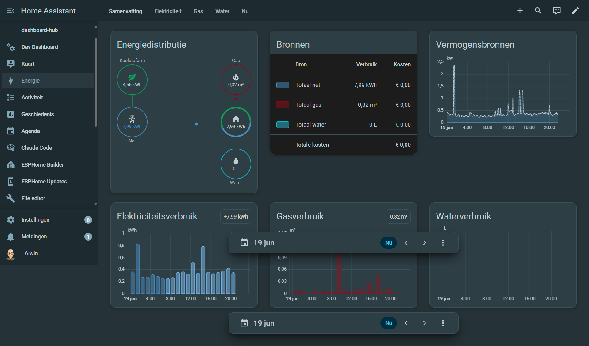
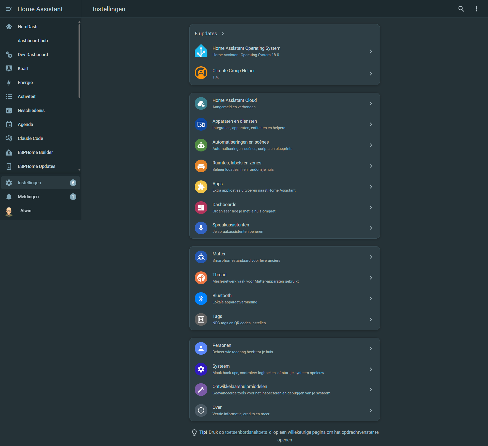

# Space Gray Theme for Home Assistant

A deep teal-gray theme with soft blue accents for Home Assistant. Designed for dark-mode dashboards with excellent readability and a calm, professional look.





## Colors

| Element | Hex |
|---------|-----|
| Background | `#253237` |
| Card | `#2d3e45` |
| Sidebar / Header | `#1e2a2f` |
| Accent | `#81a6b7` |
| Primary text | `#c1cdd3` |
| Secondary text | `#a3b4bc` |
| Border | `#3a5059` |

## Installation

### HACS (recommended)

1. Open HACS in Home Assistant
2. Go to **Frontend** > **3-dot menu** > **Custom repositories**
3. Add `HumAssist/ha-theme-space-gray` as category **Theme**
4. Search for "Space Gray" and install
5. Restart Home Assistant
6. Go to **Profile** > **Theme** and select **Space Gray**

### Manual

1. Copy `themes/space_gray.yaml` to your Home Assistant `themes/` directory
2. Make sure your `configuration.yaml` includes:
   ```yaml
   frontend:
     themes: !include_dir_merge_named themes
   ```
3. Restart Home Assistant

## Part of the Space Gray family

This theme is part of a consistent Space Gray look across self-hosted services. The same palette is available for:

- **Authentik** (custom CSS)
- **Homarr** (Mantine CSS variables)
- **Sonarr / Radarr / Prowlarr / Bazarr** (ThemePark `space-gray`)
- **Nginx Proxy Manager** (custom error pages)

## License

MIT
